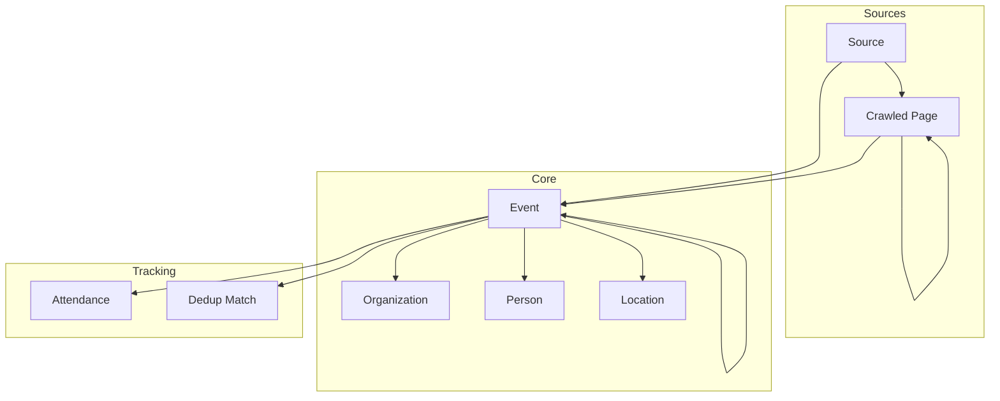

# UnlockEvents Database ERD

## Entity Relationship Diagram

```mermaid
erDiagram
    %% ===================
    %% CORE ENTITIES
    %% ===================

    tenant {
        uuid id PK
        text name
        text slug UK
        jsonb settings
        timestamp created_at
        timestamp updated_at
        timestamp deleted_at
    }

    source {
        uuid id PK
        uuid tenant_id FK
        int version
        text category "web_page|social_post|feed|api|manual"
        text platform "eventbrite|facebook|linkedin|etc"
        text name
        text url
        text feed_url "nullable RSS/Atom"
        text description
        jsonb crawl_config
        text status "active|paused|error|archived"
        timestamp last_crawled_at
        timestamp next_crawl_at
        jsonb provenance
        timestamp created_at
        timestamp updated_at
        timestamp deleted_at
    }

    crawled_page {
        uuid id PK
        uuid tenant_id FK
        uuid source_id FK
        uuid parent_page_id FK "nullable self-ref"
        int version
        text url UK
        int depth
        text content_hash
        text storage_path "blob reference"
        text status "pending|fetched|parsed|failed"
        jsonb metadata
        jsonb provenance
        timestamp fetched_at
        timestamp created_at
        timestamp updated_at
        timestamp deleted_at
    }

    organization {
        uuid id PK
        uuid tenant_id FK
        int version
        text name
        text description
        text website
        text logo_url
        jsonb metadata
        jsonb provenance
        timestamp created_at
        timestamp updated_at
        timestamp deleted_at
    }

    person {
        uuid id PK
        uuid tenant_id FK
        int version
        text full_name
        text bio
        text profile_url
        text avatar_url
        jsonb metadata
        jsonb provenance
        timestamp created_at
        timestamp updated_at
        timestamp deleted_at
    }

    location {
        uuid id PK
        uuid tenant_id FK
        int version
        text name
        text venue_name "nullable"
        text address_line1
        text address_line2
        text city
        text state
        text postal_code
        text country
        geography coordinates "PostGIS point"
        text timezone
        boolean is_virtual
        text virtual_url "nullable"
        text virtual_platform "nullable"
        jsonb metadata
        jsonb provenance
        timestamp created_at
        timestamp updated_at
        timestamp deleted_at
    }

    event {
        uuid id PK
        uuid tenant_id FK
        int version
        text title
        text description "free-form natural language"
        timestamp starts_at
        timestamp ends_at
        text timezone
        boolean is_recurring
        text recurrence_rule "iCal RRULE"
        uuid recurrence_parent_id FK "nullable self-ref"
        text status "draft|published|cancelled|postponed"
        boolean is_free
        decimal price_min
        decimal price_max
        text price_currency
        text registration_url
        text image_url
        jsonb metadata
        tsvector search_vector "full-text"
        jsonb provenance
        timestamp created_at
        timestamp updated_at
        timestamp deleted_at
    }

    %% ===================
    %% JUNCTION TABLES
    %% ===================

    event_source {
        uuid id PK
        uuid tenant_id FK
        uuid event_id FK
        uuid source_id FK
        uuid crawled_page_id FK
        text external_id "source's event ID"
        text source_url "canonical URL at source"
        timestamp discovered_at
        timestamp last_seen_at
        timestamp created_at
    }

    event_location {
        uuid id PK
        uuid tenant_id FK
        uuid event_id FK
        uuid location_id FK
        text role "primary|secondary|overflow"
        int sort_order
        timestamp valid_from
        timestamp valid_until
        timestamp created_at
    }

    event_organization {
        uuid id PK
        uuid tenant_id FK
        uuid event_id FK
        uuid organization_id FK
        text role "host|sponsor|partner|vendor"
        int sort_order
        timestamp valid_from
        timestamp valid_until
        timestamp created_at
    }

    event_person {
        uuid id PK
        uuid tenant_id FK
        uuid event_id FK
        uuid person_id FK
        text role "organizer|speaker|performer|panelist"
        int sort_order
        timestamp valid_from
        timestamp valid_until
        timestamp created_at
    }

    event_relationship {
        uuid id PK
        uuid tenant_id FK
        uuid from_event_id FK
        uuid to_event_id FK
        text relationship_type "parent|series|sequel|related|supersedes"
        jsonb metadata
        timestamp valid_from
        timestamp valid_until
        timestamp created_at
    }

    %% ===================
    %% CONTACT INFO (NORMALIZED)
    %% ===================

    person_email {
        uuid id PK
        uuid tenant_id FK
        uuid person_id FK
        text email
        text label "work|personal|other"
        boolean is_primary
        timestamp valid_from
        timestamp valid_until
        timestamp created_at
    }

    person_phone {
        uuid id PK
        uuid tenant_id FK
        uuid person_id FK
        text phone
        text label "work|mobile|other"
        boolean is_primary
        timestamp valid_from
        timestamp valid_until
        timestamp created_at
    }

    person_social {
        uuid id PK
        uuid tenant_id FK
        uuid person_id FK
        text platform "linkedin|twitter|facebook|instagram"
        text handle
        text profile_url
        timestamp valid_from
        timestamp valid_until
        timestamp created_at
    }

    organization_social {
        uuid id PK
        uuid tenant_id FK
        uuid organization_id FK
        text platform
        text handle
        text profile_url
        timestamp valid_from
        timestamp valid_until
        timestamp created_at
    }

    %% ===================
    %% DEDUP & TRACKING
    %% ===================

    event_attendance {
        uuid id PK
        uuid tenant_id FK
        uuid event_id FK
        int expected_count
        int actual_count
        text source "registration|manual|estimate"
        timestamp recorded_at
        timestamp created_at
    }

    dedup_match {
        uuid id PK
        uuid tenant_id FK
        uuid event_a_id FK
        uuid event_b_id FK
        decimal confidence_score
        text status "pending|confirmed|rejected"
        uuid reviewed_by FK "nullable"
        timestamp reviewed_at
        jsonb match_reasons
        timestamp created_at
        timestamp updated_at
    }

    dedup_config {
        uuid id PK
        uuid tenant_id FK
        decimal auto_merge_threshold
        decimal review_threshold
        decimal rejection_threshold
        jsonb field_weights
        boolean is_active
        timestamp created_at
        timestamp updated_at
    }

    %% ===================
    %% RELATIONSHIPS
    %% ===================

    tenant ||--o{ source : "has"
    tenant ||--o{ crawled_page : "has"
    tenant ||--o{ organization : "has"
    tenant ||--o{ person : "has"
    tenant ||--o{ location : "has"
    tenant ||--o{ event : "has"

    source ||--o{ crawled_page : "produces"
    crawled_page ||--o{ crawled_page : "parent of"

    event ||--o{ event_source : "discovered via"
    source ||--o{ event_source : "finds"
    crawled_page ||--o{ event_source : "extracted from"

    event ||--o{ event_location : "held at"
    location ||--o{ event_location : "hosts"

    event ||--o{ event_organization : "organized by"
    organization ||--o{ event_organization : "organizes"

    event ||--o{ event_person : "features"
    person ||--o{ event_person : "participates in"

    event ||--o{ event_relationship : "from"
    event ||--o{ event_relationship : "to"

    person ||--o{ person_email : "has"
    person ||--o{ person_phone : "has"
    person ||--o{ person_social : "has"
    organization ||--o{ organization_social : "has"

    event ||--o{ event_attendance : "tracks"
    event ||--o{ dedup_match : "event_a"
    event ||--o{ dedup_match : "event_b"

    event ||--o{ event : "recurrence parent"

    tenant ||--o{ dedup_config : "has"
```

## Simplified Overview

## Key Design Patterns

### 1. Multi-Tenancy

Every table includes `tenant_id` for data isolation.

### 2. Soft Deletes

All entities have `deleted_at` for recoverable deletion.

### 3. Versioning

Core entities track `version` for optimistic locking and history.

### 4. Temporal Validity

Junction tables include `valid_from`/`valid_until` for time-bound relationships.

### 5. Provenance

Core entities include `provenance` JSONB for tracking data origin.

### 6. Flexible Relationships

`event_relationship` table enables arbitrary event-to-event connections.
